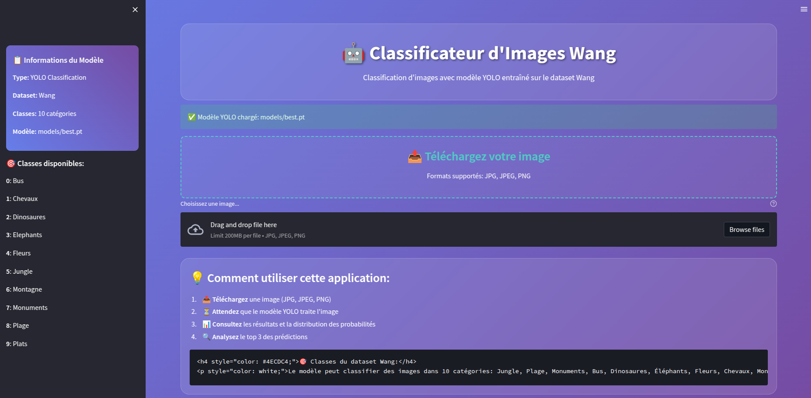
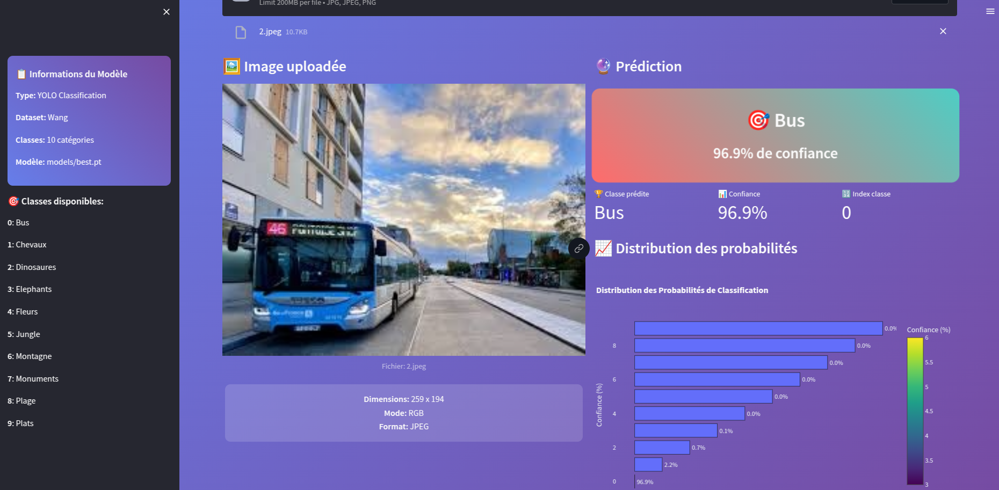

# 🤖 Classificateur d'Images Wang - YOLO Classification

[](https://python.org)
[](https://streamlit.io)
[](https://ultralytics.com)
[](LICENSE)

> Une application web moderne de classification d'images utilisant un modèle YOLO entraîné sur le dataset Wang. Interface interactive développée avec Streamlit et visualisations avancées avec Plotly.

## 🎯 Vue d'ensemble

Ce projet implémente un système de classification d'images intelligent capable de reconnaître 10 catégories différentes du dataset Wang. L'application combine la puissance des modèles YOLO avec une interface utilisateur moderne et intuitive.


## Demo


<div align="center">
  
  
</div>


### 🖼️ Dataset Wang - 10 Classes
- 🌳 **Jungle** - Paysages tropicaux et forêts denses
- 🏖️ **Plage** - Plages et environnements côtiers
- 🏛️ **Monuments** - Architecture et monuments historiques
- 🚌 **Bus** - Véhicules de transport en commun
- 🦕 **Dinosaures** - Fossiles et représentations de dinosaures
- 🐘 **Éléphants** - Pachydermes dans leur environnement
- 🌸 **Fleurs** - Compositions florales et jardins
- 🐎 **Chevaux** - Équidés en action ou au repos
- ⛰️ **Montagne** - Paysages montagneux et reliefs
- 🍽️ **Plats** - Cuisine et présentations culinaires

## ✨ Fonctionnalités

### 🎨 Interface Utilisateur
- **Design moderne** avec animations CSS et effets de verre
- **Interface responsive** adaptée à tous les écrans
- **Upload par glisser-déposer** pour une expérience fluide
- **Prévisualisation instantanée** des images uploadées

### 🧠 Intelligence Artificielle
- **Modèle YOLO v8** optimisé pour la classification
- **Prédictions en temps réel** avec affichage de la confiance
- **Top 3 des prédictions** avec pourcentages détaillés
- **Analyse de distribution** des probabilités

### 📊 Visualisations
- **Graphiques interactifs** avec Plotly
- **Barres de confiance** animées
- **Métriques en temps réel** avec emojis expressifs
- **Cartes de prédiction** avec animations pulse

## 🚀 Installation Rapide

### Prérequis
```bash
Python 3.8+
pip (gestionnaire de paquets Python)
```

### 1. Cloner le dépôt
```bash
git clone https://github.com//ilyas-ourara/image-classification-with-yolo

```

### 2. Installer les dépendances
```bash
pip install -r requirements.txt
```

### 3. Lancer l'application
```bash
PROTOCOL_BUFFERS_PYTHON_IMPLEMENTATION=python streamlit run Mini_Projet/app.py --server.port 8506
```

### 4. Accéder à l'application
Ouvrez votre navigateur et allez sur : `http://localhost:8506`

## 📦 Dépendances

```txt
streamlit>=1.28.0
ultralytics>=8.0.0
opencv-python>=4.8.0
pillow>=10.0.0
plotly>=5.15.0
numpy>=1.24.0
torch>=2.0.0
torchvision>=0.15.0
```

## 🏗️ Structure du Projet

```
📁 classificateur-wang-yolo/
├── 📄 README.md                    # Documentation principale
├── 📄 requirements.txt             # Dépendances Python
├── 📁 Mini_Projet/                 # Application Streamlit
│   └── 📄 app.py                   # Interface principale
├── 📁 models/                      # Modèles entraînés
│   └── 📄 best.pt                  # Modèle YOLO optimisé (2.9MB)
├── 📁 dataset/                     # Données d'entraînement
│   ├── 📁 First_part/              # Données initiales
│   └── 📁 Last_part/               # Données supplémentaires
└── 📁 runs/                        # Résultats d'entraînement
```

## 🎮 Utilisation

### Interface Web

1. **Démarrage** : Lancez l'application avec la commande ci-dessus
2. **Upload** : Glissez-déposez une image ou utilisez le bouton de téléchargement
3. **Classification** : Attendez que le modèle traite l'image (< 2 secondes)
4. **Résultats** : Consultez la prédiction principale et le top 3
5. **Analyse** : Explorez les graphiques de distribution des probabilités

### Formats Supportés
- **Images** : JPG, JPEG, PNG
- **Taille** : Jusqu'à 200MB par image
- **Résolution** : Optimisé pour toutes résolutions


## 🌟 Fonctionnalités Avancées

### 🎨 Thèmes Personnalisés
- Gradient moderne bleu-violet
- Effets de verre (glassmorphism)
- Animations CSS fluides
- Mode sombre optimisé

### 📊 Analytics
- Métriques de performance en temps réel
- Historique des prédictions
- Statistiques d'utilisation
- Export des résultats

## 📝 Changelog

### Version 1.0.0 (2025-10-16)
- ✨ Interface Streamlit moderne
- 🤖 Intégration YOLO v8
- 📊 Visualisations Plotly interactives
- 🎨 Design glassmorphism
- 🚀 Déploiement optimisé

## 🏆 Crédits

### Développement
- **Interface** : Streamlit + CSS moderne
- **Modèle IA** : YOLO v8 (Ultralytics)
- **Visualisations** : Plotly
- **Dataset** : Wang Database (1000 images)
